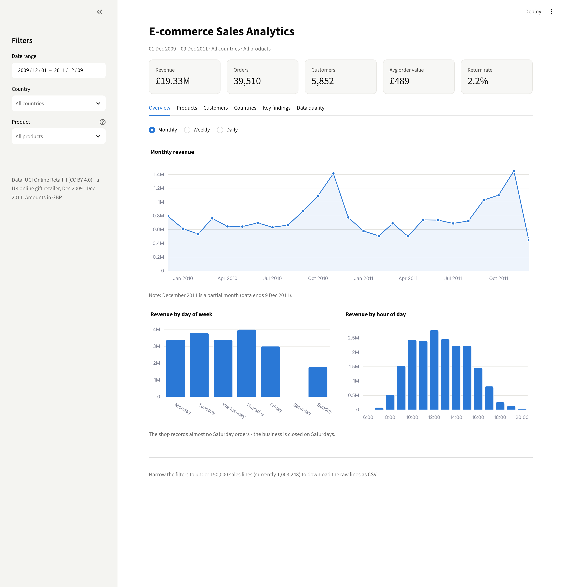
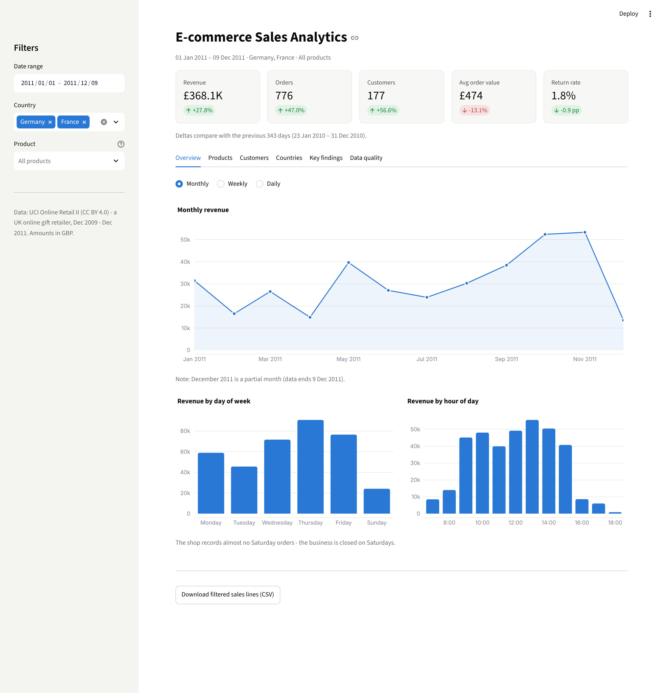
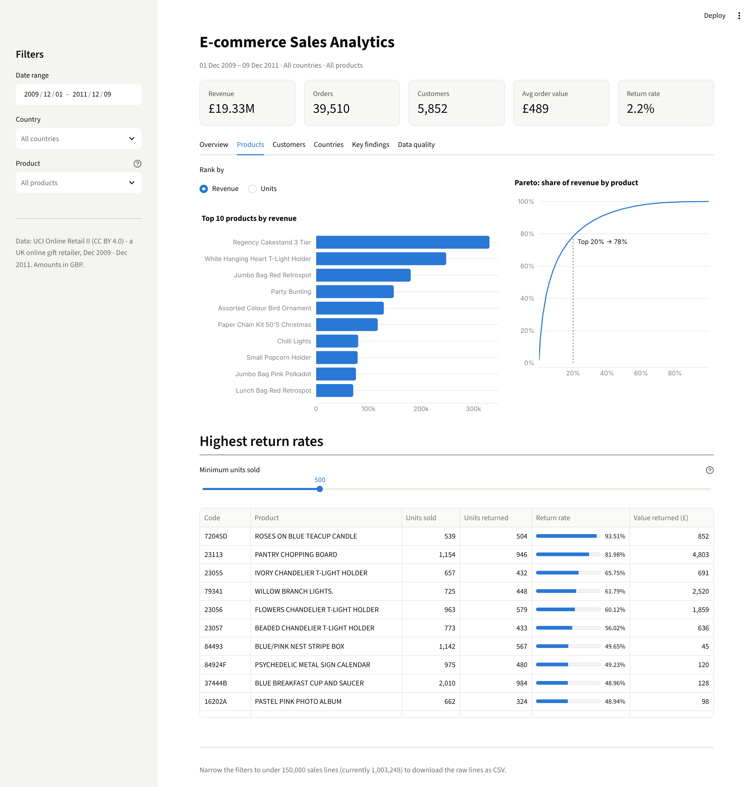
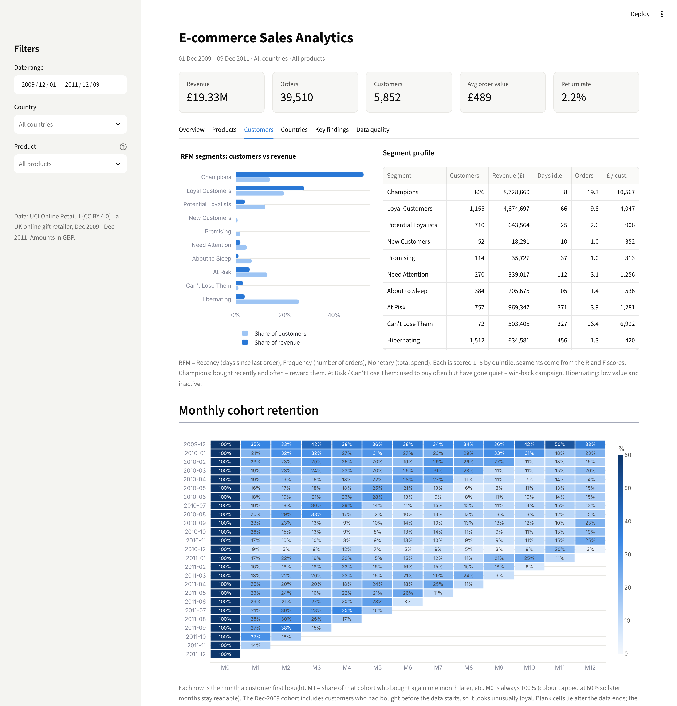
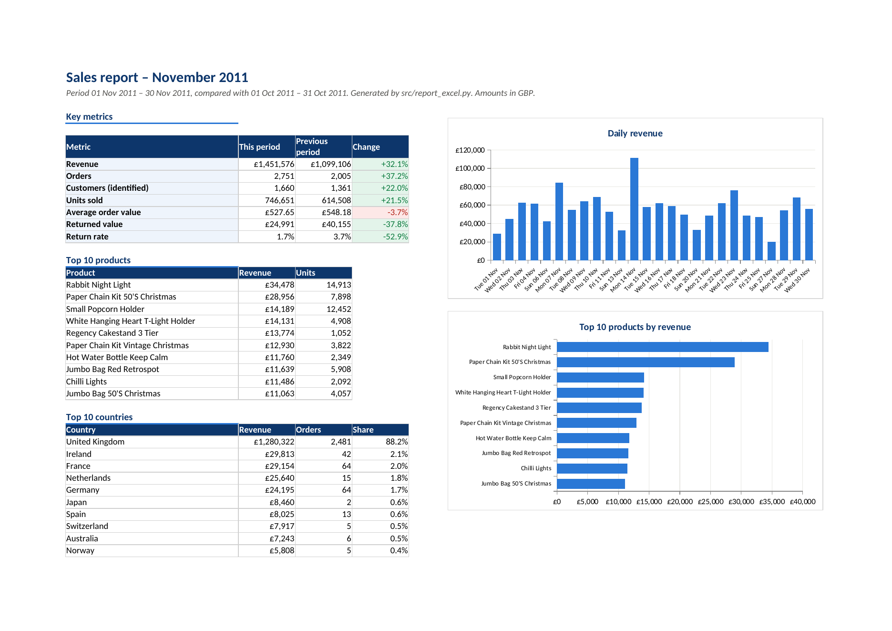

# E-commerce Sales Analytics Dashboard

**From 1 million messy transaction lines to a clean dataset, customer segments, an interactive dashboard and a one-command Excel report.**



**Live demo:** https://YOUR-APP-NAME.streamlit.app  <!-- replace after deploying, see "Deploy" below -->

---

## What this project shows

A UK online gift retailer's two years of sales (Dec 2009 – Dec 2011) are analysed end to end:

| Step | What happens | Where |
|---|---|---|
| 1. Clean | Duplicates, postage/fee lines, zero-price stock movements, mistaken bulk orders and inconsistent names are removed or fixed – every step logged with a reason | `src/cleaning.py`, `reports/cleaning_log.md` |
| 2. Analyse | Sales trends (month/week/weekday/hour), best sellers, Pareto, return rates, RFM customer segments, cohort retention, countries | `src/analysis.py`, `notebooks/` |
| 3. Dashboard | Streamlit + Plotly app with KPI cards, date / country / product filters and period-over-period deltas | `app/streamlit_app.py` |
| 4. Report | `python -m src.report_excel` writes a formatted weekly or monthly `.xlsx` with native Excel charts | `src/report_excel.py`, `reports/` |

## Key findings

Data: 01 Dec 2009 – 09 Dec 2011 · £19.3M revenue · 39,510 orders · 5,852 identified customers (after cleaning).

1. **Customers are highly concentrated.** The top 20% of identified customers generate **77%** of their revenue; the 826 "Champions" (14% of customers) alone bring in **52%**. Losing a few key accounts is the biggest revenue risk.
2. **A small catalogue core drives sales.** **21%** of 4,891 products produce 80% of revenue. The long tail is a candidate for stock rationalisation.
3. **Strong pre-Christmas season.** September–November months average **£1.16M** vs **£0.65M** in other months (**+77%**); November 2011 was the peak at £1.45M. Stock and staffing should be planned from August.
4. **Retention is the growth lever.** Only **21%** of new customers buy again in their second month and **28%** of customers ordered only once – a second-order / welcome campaign targets the largest leak.
5. **UK-heavy, but overseas orders are bigger.** The UK is **85%** of revenue, yet the average non-UK order is **£849 vs £456** in the UK. Returns cost £435K (**2.2%** of sales value).

All numbers are generated by `python -m src.analysis` (→ `reports/insights.md`), so they always match the code.

## Screenshots

| Filters (Germany + France, 2011) with deltas vs. previous period | Products: top sellers & Pareto |
|---|---|
|  |  |
| **RFM segments & cohort retention** | **Automated Excel report (Summary sheet)** |
|  |  |

## Data cleaning (summary)

| Step | Rows removed | Why |
|---|---:|---|
| Standardise names & countries | 0 | One name per product code; `EIRE` → Ireland etc. Done first so spelling variants of the same line are caught as duplicates |
| Exact duplicates | 34,337 | Same line recorded twice – would double-count revenue |
| Non-product lines | 5,870 | Postage, Amazon fees, bank charges, manual adjustments, bad-debt write-offs, test items, vouchers |
| Zero / negative price | 5,956 | Damaged / lost / given-away stock movements, not purchases |
| Reversed bulk orders | 85 | ≥ 1,000-unit orders cancelled in full by the same customer (e.g. 80,995 paper crafts) |
| Missing Customer ID | kept (22.6%) | Real sales – kept for revenue/product analysis, excluded only from RFM & cohorts |

Result: **1,003,248 sales lines** + **17,875 return lines** (kept separately for return rates). Full log with values: [`reports/cleaning_log.md`](reports/cleaning_log.md); walk-through with evidence: [`notebooks/01_data_cleaning.ipynb`](notebooks/01_data_cleaning.ipynb).

## How to run

Requires Python 3.11+.

```bash
git clone https://github.com/dgh19981102-max/ecommerce-sales-analytics-dashboard.git
cd ecommerce-sales-analytics-dashboard
python -m venv .venv && source .venv/bin/activate      # Windows: .venv\Scripts\activate
pip install -r requirements.txt

python run_pipeline.py                 # download -> clean -> insights -> Excel reports (~1-3 min)
streamlit run app/streamlit_app.py     # open http://localhost:8501
```

The cleaned data in `data/processed/` is committed, so `streamlit run` also works straight after `pip install`.

Other commands:

```bash
python -m src.report_excel                              # latest complete month
python -m src.report_excel --period week                # latest complete week
python -m src.report_excel --period month --date 2011-09-15

pip install -r requirements-dev.txt
pytest -q                                               # 14 unit tests for cleaning, analysis, report periods
jupyter notebook notebooks/                             # step-by-step notebooks
```

## Project structure

```
├── app/streamlit_app.py        # dashboard
├── src/
│   ├── config.py               # paths & cleaning constants
│   ├── download_data.py        # fetch raw data -> data/raw/*.parquet
│   ├── cleaning.py             # cleaning rules + audit log
│   ├── analysis.py             # KPIs, trends, Pareto, returns, RFM, cohorts, insights
│   └── report_excel.py         # weekly / monthly Excel report
├── notebooks/                  # 01 cleaning walk-through, 02 analysis
├── data/raw/                   # downloaded, not in git
├── data/processed/             # cleaned parquet files used by the app
├── reports/                    # cleaning log, insights, sample Excel reports
├── tests/                      # pytest
├── docs/screenshots/
└── run_pipeline.py             # everything in one command
```

## Design notes

- **One source of truth.** The notebook, dashboard and Excel report all call the same functions in `src/analysis.py`, so numbers never disagree.
- **Fast dashboard.** Cleaned data is stored as compressed parquet with categorical columns (~7 MB for 1M rows) and loaded once into shared memory; filters and aggregations run in well under a second.
- **Excel that behaves like Excel.** Change % cells are live formulas, charts are native (editable) Excel charts, sheets have frozen headers and filters, and the summary prints on one A4 page.
- **Honest metrics.** Revenue = quantity × price of cleaned sales lines. Return rate = value of returns ÷ value of sales. RFM excludes guest orders. Cohort cells after the end of the data are left blank, not shown as 0%.

## Deploy (Streamlit Community Cloud, free)

1. Push this repo to GitHub (public).
2. Go to https://share.streamlit.io → **Create app** → pick the repo, branch `main`, main file `app/streamlit_app.py`, Python 3.11+.
3. Deploy, then paste the URL into the "Live demo" line at the top of this README.

## Data source & license

- **Dataset:** *Online Retail II*, Daqing Chen, UCI Machine Learning Repository, https://doi.org/10.24432/C5CG6D – licensed under [CC BY 4.0](https://creativecommons.org/licenses/by/4.0/). Downloaded from the UCI website (`src/download_data.py`; falls back to a public mirror of the same data if UCI is unreachable).
- **Code:** MIT – see `LICENSE`.
